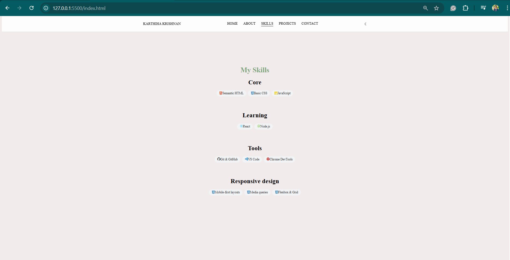

# My-Portfolio
This is my personal portfolio website built using **HTML**, **CSS**, and **JavaScript**.  
It showcases my skills, projects, and contact information in a clean and modern design.

## Live Demo
🔗 **View Website:** https://karthihakrishnan.github.io/My-Portfolio/

## Features
- Responsive design for all screen sizes
- Clean and modern UI layout
- Dark / Light mode toggle
- Smooth animations using CSS / GSAP
- About Me section with professional introduction
- Skills section with categorized skill badges
- Projects showcase (expandable for future projects)
- Contact details with clickable links
- Hosted using GitHub Pages
  
## Technologies Used
- **HTML5**-semantic structure
- **CSS3**-Flexbox, animations, responsive design
- **JavaScript(ES6+)**-interactivity & theme toggle
- **Git & GitHub**-version control
- **GitHub Pages** (for hosting)

## 📸 Screenshots

  
*Desktop view showing Skills section.*

  
*Mobile view showcasing responsive design.*

  
## Folder Structure
My-Portfolio/
│── index.html
│── app.js
│── projects.html
│── style.css
│── images/
    ├── My-photo.jpg
    ├── desktop-mode.ong
    ├── mobile-mode.png
    ├── light-mode.png
    └── dark-mode.png
└── README.md

## How to Use
1. Clone the repository:
   git clone https://github.com/karthihakrishnan/My-Portfolio.git
2. Open `index.html` in any browser.
3. Customize the content and styles as needed.
   
## Completed Enhancements
✔️ Dark / Light mode toggle
✔️ Improved mobile responsiveness
✔️ CSS / GSAP animations
✔️ Clean UI with structured sections
   
## Future Improvements
- Add more real-world projects
- Add project filtering or slider
- Improve accessibility (ARIA, contrast, keyboard navigation)
- Optimize performance
  
## Contact Me
- **LinkedIn:** https://www.linkedin.com/in/karthiha-krishnan
- **Email:** karthiha.au@gmail.com  
- **GitHub:** https://github.com/KarthihaKrishnan
  
## Acknowledgements
Thanks for visiting my portfolio!
If you like this project, feel free to ⭐ the repository.

